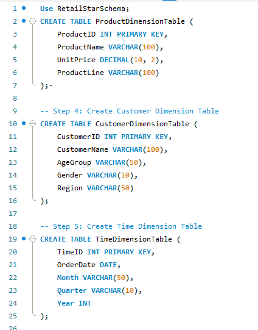
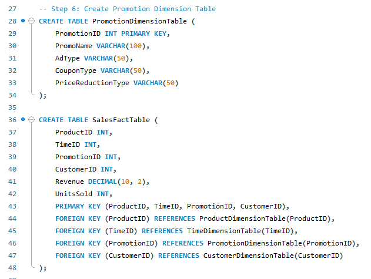
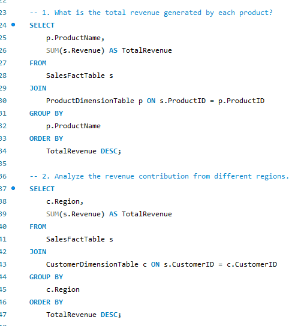

# SQL
These are sample codes did for the course under this topic.

## Overview: 

These are some examples of my SQL tasks that I needed to do during the course. I worked on creating a structured data warehouse schema using the RetailStarSchema, where I defined several dimension tables such as ProductDimensionTable, CustomerDimensionTable, TimeDimensionTable, and PromotionDimensionTable. Each table was designed with appropriate attributes and primary keys to organize data effectively, while the SalesFactTable was created to store measurable data like revenue and units sold, linking all dimension tables through foreign keys. This setup demonstrates my understanding of star schema design and relational database principles. In addition to database design, I also performed analytical queries, such as calculating total revenue generated by each product and analyzing revenue contributions across different regions using joins, aggregations, and grouping techniques. These tasks highlight my ability to both design databases and extract meaningful business insights using SQL.

## SQL Tasks

Here are some examples of SQL queries and schema designs I created:

